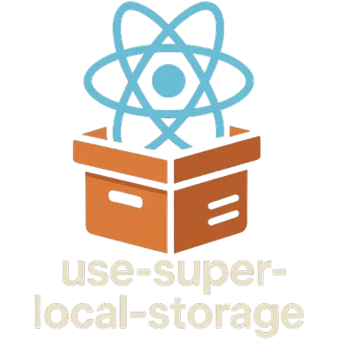

  

  
  
  

I’m a **developer** who started by building Flash games as a kid — that curiosity grew into a passion for creating things that are interactive, useful, and fast.

I moved from making small experiments to writing production systems in **Java**, and eventually found my space in **web development**, where I now work across the full stack — from clean, responsive UIs to reliable backend APIs and cloud infrastructure.

Currently, I'm focused on:

- Building **SaaS platforms** and **cloud-native applications**
- Designing responsive and engaging **user interfaces**
- Developing scalable **backend APIs** with modern frameworks
- Exploring **AI integration** and **automation** in web products
- Prototyping and validating **new product ideas** with fast iteration cycles
- Creating **real-time interactive experiences** for web and desktop
- Improving **developer workflows** and **DX** through internal tools and automation
- Writing maintainable, modular codebases with **scalability and performance** in mind

## Projects (Click the icons)

## Small projects (Click the icons)

## Public / Open source (Click the icons)

## Libraries

## Extensions

## Skills (Languages, frameworks, tools)

          
